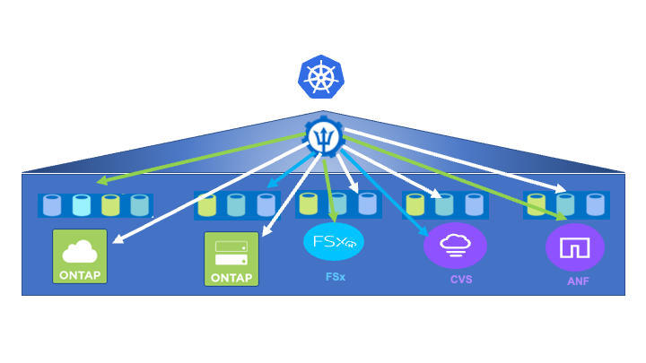

= Descripción general de Astra Trident
:hardbreaks:
:allow-uri-read: 
:nofooter: 
:icons: font
:linkattrs: 
:imagesdir: ./../../media/

Astra Trident es un orquestador de almacenamiento de código abierto y totalmente compatible para contenedores y distribuciones de Kubernetes, incluido Anthos. Trident funciona con toda la cartera de almacenamiento de NetApp, incluido ONTAP de NetApp, y también admite conexiones NFS e iSCSI. Trident acelera el flujo de trabajo de DevOps al permitir que los usuarios finales aprovisionen y gestionen el almacenamiento desde sus sistemas de almacenamiento de NetApp sin necesidad de intervención del administrador de almacenamiento.

Un administrador puede configurar varios back-ends de almacenamiento a partir de necesidades de proyectos y modelos de sistema de almacenamiento que permiten funciones de almacenamiento avanzadas, como compresión, tipos de disco específicos y niveles de calidad de servicio que garantizan un cierto nivel de rendimiento. Una vez definidas estos back-ends pueden ser utilizados por los desarrolladores en sus proyectos para crear reclamaciones de volumen persistente (RVP) y conectar almacenamiento persistente a sus contenedores bajo demanda.

Astra Trident tiene un rápido ciclo de desarrollo y, al igual que Kubernetes, se publica cuatro veces al año.

Encontrará la documentación de la última versión de Astra Trident https://docs.netapp.com/us-en/trident/index.html["aquí"]. Existe una matriz de compatibilidad con la versión de Trident probada en la que se puede encontrar la distribución de Kubernetes https://docs.netapp.com/us-en/trident/trident-get-started/requirements.html#supported-frontends-orchestrators["aquí"].

A partir del lanzamiento de la versión 20.04, el operador de Trident realiza la configuración de Trident. El operador facilita las puestas en marcha a gran escala y ofrece soporte adicional, incluida la reparación automática de los pods que se implementan como parte de la instalación de Trident.

Con la versión 22.04, se puso a disposición un gráfico Helm para facilitar la instalación del operador Trident.

Para obtener más información sobre la instalación de Astra Trident, consulte https://docs.netapp.com/us-en/trident/trident-get-started/kubernetes-deploy.html["aquí"].

== Cree un back-end de sistema de almacenamiento

Una vez finalizada la instalación del operador de Astra Trident, debe configurar el back-end para la plataforma de almacenamiento específica de NetApp que esté usando. Siga el siguiente enlace para continuar con la instalación y configuración de Astra Trident.link:https://docs.netapp.com/us-en/trident/trident-get-started/kubernetes-postdeployment.html#step-1-create-a-backend["Cree un back-end."]

== Cree una clase de almacenamiento

Después de crear el back-end, debe crear una clase de almacenamiento que los usuarios de Kubernetes especifiquen cuando quieran un volumen. Los usuarios de Kubernetes aprovisionan volúmenes mediante reclamaciones de volumen persistente (RVP) que especifican una clase de almacenamiento por nombre. Siga el enlace siguiente para crear una clase de almacenamiento.link:https://docs.netapp.com/us-en/trident/trident-get-started/kubernetes-postdeployment.html#step-2-create-a-storage-class["Cree una clase de almacenamiento"]

== Aprovisione un volumen de forma dinámica

Debe crear un objeto de solicitud de volumen persistente (RVP) de Kubernetes mediante la clase de almacenamiento para aprovisionar dinámicamente un volumen. Siga el siguiente vínculo para crear un objeto de PVC.link:https://docs.netapp.com/us-en/trident/trident-get-started/kubernetes-postdeployment.html#step-3-provision-your-first-volume["Cree una RVP"]

== Utilice el volumen

El volumen aprovisionado en el paso anterior puede ser utilizado por una aplicación montando el volumen en el pod.el enlace siguiente muestra un ejemplo.link:https://docs.netapp.com/us-en/trident/trident-get-started/kubernetes-postdeployment.html#step-4-mount-the-volumes-in-a-pod["Monte el volumen en un pod"]

link:a-w-n_overview_advanced.html["Siguiente: Opciones de configuración avanzada para Anthos."]
